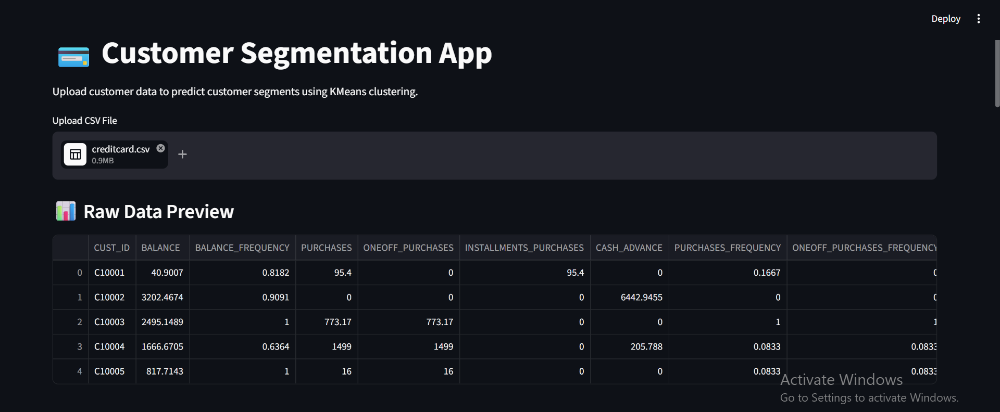
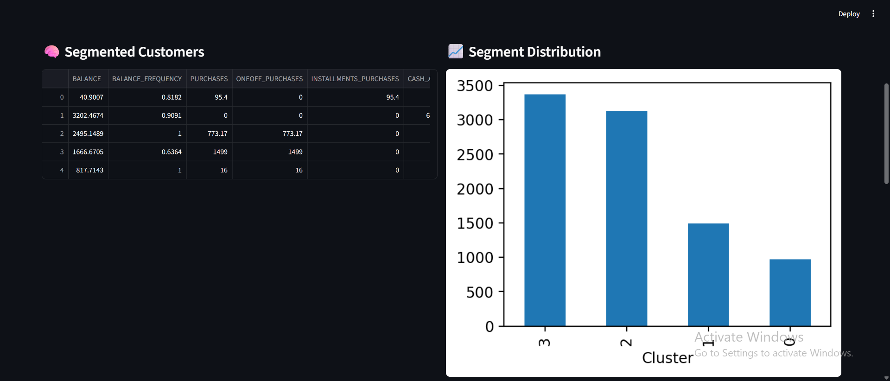
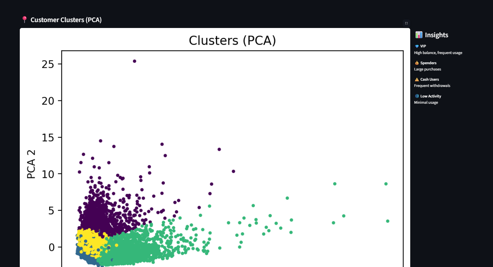

# 💳 Customer Segmentation App

A machine learning web application that segments credit card customers into distinct groups using **KMeans clustering**. Built with Streamlit for interactive data exploration and business insights.

---

## 🚀 Live Demo

👉 *[Add your deployed app link here]*

---

## 📌 Project Overview

This project analyzes customer behavior data and groups users into meaningful segments to support **data-driven marketing strategies**.

Using clustering, the app identifies patterns such as:

* High-value customers
* Frequent spenders
* Cash advance users
* Low activity users

---

## 🧠 Features

* 📂 Upload your own CSV dataset
* 📊 Real-time data preview
* 🧠 Automatic customer segmentation (KMeans)
* 📈 Cluster distribution visualization
* 📍 PCA-based cluster visualization
* 💡 Business insights for each segment

---

## 📸 App Preview

### 1. Data Upload & Preview



### 2. Customer Segmentation Results



### 3. Visualization & Insights



---

## ⚙️ Tech Stack

* **Python**
* **Pandas & NumPy**
* **Scikit-learn (KMeans, PCA, StandardScaler)**
* **Matplotlib**
* **Streamlit**
* **Joblib**

---

## 🗂️ Project Structure

```
customer-segmentation-app/
│
├── app.py                 # Streamlit app
├── requirements.txt      # Dependencies
├── README.md
│
├── models/
│   ├── kmeans_model.pkl
│   └── scaler.pkl
│
├── src/
│   └── train.py          # Model training script
│
├── data/
│   └── creditcard.csv    # Dataset
│
├── assets/
│   ├── app_1.png
│   ├── app_2.png
│   └── app_3.png
```

---

## 🧪 How It Works

1. Load dataset
2. Clean and preprocess data
3. Scale features using StandardScaler
4. Apply KMeans clustering
5. Reduce dimensions using PCA for visualization
6. Display clusters and insights

---

## ▶️ Run Locally

### 1. Clone the repository

```
git clone https://github.com/YOUR_USERNAME/customer-segmentation-app.git
cd customer-segmentation-app
```

### 2. Create virtual environment

```
python -m venv venv
venv\Scripts\activate
```

### 3. Install dependencies

```
pip install -r requirements.txt
```

### 4. Train the model

```
python src/train.py
```

### 5. Run the app

```
streamlit run app.py
```

---

## 📊 Dataset

* Credit Card Dataset for Clustering (Kaggle)
* Contains ~9000 customers and 18 behavioral features

---

## 💡 Business Value

This app helps businesses:

* Identify high-value customers
* Improve marketing targeting
* Detect low engagement users
* Optimize financial strategies

---

## 📬 Author

**Your Name**

* GitHub: https://github.com/YOUR_USERNAME
* LinkedIn: *Add your link*

---

## ⭐ If you like this project

Give it a star ⭐ on GitHub!
